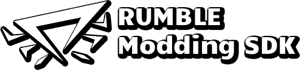

  

A specialized SDK for developing or working with supported RUMBLE Mods.

## Support
List of Mods supported by the RUMBLE Modding SDK:
| Mod | Developer | Link |
| --- | --------- | ---- |
| RUMBLE Structure Saver | Cxntrxl | [[Download]](https://cdn.discordapp.com/attachments/708278378406346792/1304631022104870993/StructureSaving.dll?ex=673017d2&is=672ec652&hm=707c4b38badf8257a6cac6de3573bcd57d6ea39929e97f10fd6d91e6187ffe5c&) |

## Contact
If you'd like to contribute or have mod features otherwise implemented within the SDK, contact me @cxntrxl on Discord.

## Acknowledgements
This project contains assets built and owned by Buckethead Entertainment. The RUMBLE Modding SDK is in no way associated with Buckethead Entertainment or Unity Technologies. "Unity", Unity logos and other Unity trademarks are trademarks or registered trademarks of Unity Technologies or its affiliates in the U.S. and elsewhere.
